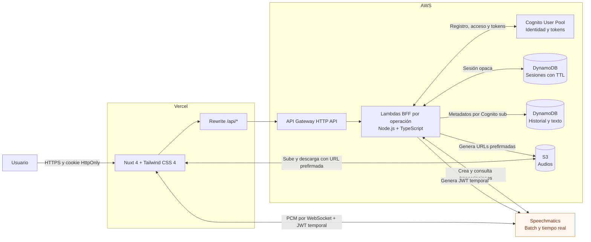

# Arquitectura de la aplicación

Diagrama de contenedores de alto nivel.

Para los archivos, el navegador solicita una carga prefirmada, envía el audio
directamente a S3 y la API entrega a Speechmatics una URL de lectura temporal.
La web consulta el estado hasta que la API guarda la transcripción completada
en DynamoDB.

En tiempo real, la API genera una credencial temporal de Speechmatics y el
navegador envía PCM por WebSocket. Al detener la grabación, la web guarda el
audio en S3 y envía el texto final a la API para incorporarlo a la biblioteca.
